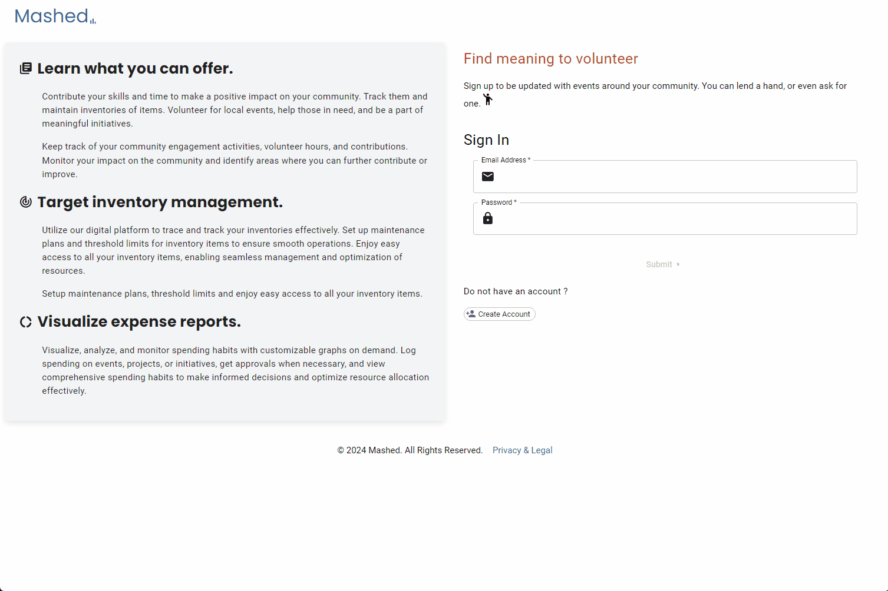

# ASSET ALERT
<!--  -->

## Overview

In today’s dynamic and fast-paced business environment, effective asset management is crucial for optimizing resources, reducing costs, and ensuring operational efficiency. AssetAlert is designed to address these needs by providing a robust solution to track your assets, manage them, and analyze them effectively.

### Purpose

The primary purpose of AssetAlert is to streamline the management of physical assets across various locations and departments within an organization. By leveraging cutting-edge technology, this application aims to enhance asset visibility, improve accountability, and support strategic decision-making.

1. Enhanced Visibility: To provide a comprehensive view of asset distribution and utilization, allowing for better management and optimization of resources.

2. Automated Reporting: To generate automated reports and analytics on asset performance, maintenance schedules, and lifecycle status.

3. Improved Accountability: To facilitate asset check-in/check-out processes, reducing losses and ensuring assets are accounted for at all times.

4. Integration Capabilities: To integrate seamlessly with existing enterprise systems (such as ERP or CMMS), providing a unified approach to asset management.

### Benefits

Increased Efficiency: By automating tracking and management processes, the application reduces manual efforts and minimizes errors, leading to greater operational efficiency.

Cost Savings: Improved visibility and control over assets help in reducing unnecessary purchases, preventing asset loss, and optimizing maintenance costs.

Enhanced Decision-Making: Data-driven insights from the application support informed decision-making, helping organizations align their asset management strategies with business goals.

Scalability: The application is designed to scale with organizational growth, accommodating a growing number of assets and users without compromising performance.

User-Friendly Interface: With an intuitive and user-friendly interface, the application ensures ease of use for all stakeholders, from asset managers to field staff.

## Contact

If you have any questions or need support, feel free to reach out to us at earmuffjam@gmail.com
