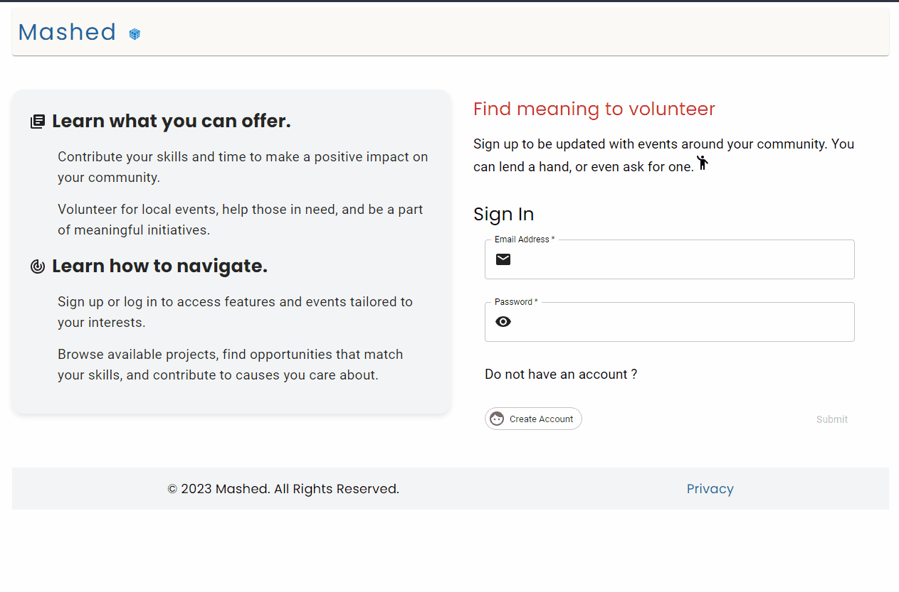
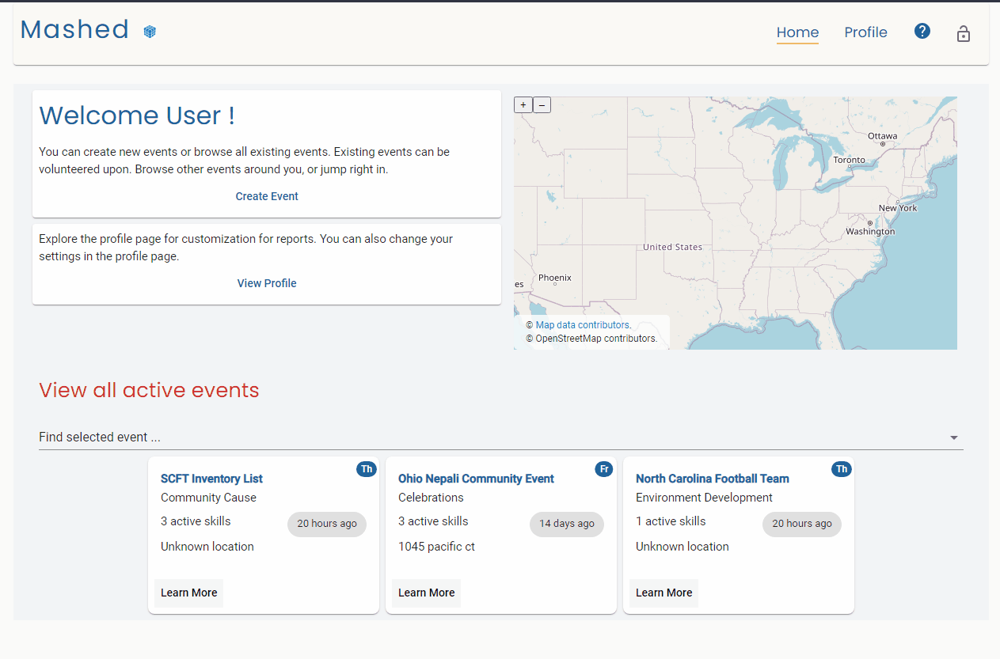

# Mashed

## Volunteer and Community Engagement Platform

**Mashed** is a dynamic web-based platform designed to foster connections between passionate volunteers and local community projects and initiatives. It serves as a central hub where individuals and organizations can unite, collaborate, and create a meaningful impact within their neighborhoods. Whether it's environmental conservation, education, social welfare, or arts and culture, we empower users to contribute their time, skills, and hearts to the causes they care deeply about.

## Key Features

| Feature             | Description                                                                                                                                                                                                                                                                                 |
| ------------------- | ------------------------------------------------------------------------------------------------------------------------------------------------------------------------------------------------------------------------------------------------------------------------------------------- |
| User Profiles       | Create profiles that show your name and contact information. You can also add small interesting topics about yourself as well. These profiles facilitate better matching between volunteers and organizations.                                                                              |
| Event Listings      | Organizations can seamlessly post event details, upcoming events, and volunteer opportunities. Share crucial information such as the cause, location, date, time, and required skills needed for each project. Booster more confidence with the ability to log expenses and visualize them. |
| Search and Match    | Learn about various other different events and connect volunteers with projects that align with their location, chosen cause, or unique skills.                                                                                                                                             |
| Communication Tools | Efficient real-time messaging and notifications make it easy for volunteers and organizations to communicate and collaborate effectively.                                                                                                                                                   |
| Impact Tracking     | Log your volunteer hours and activities, and see the positive impact your contributions have made. Be proud of the change you're creating.                                                                                                                                                  |
| Mobile-Friendly     | Stay engaged on the go! Our mobile-optimized platform ensures you can access and contribute wherever you are.                                                                                                                                                                               |

## Application Brief Demonstration

**Version 01:**

**A. Log in to view the application**

**B. View home page and sample event**

**C. View profile page**

## Contact

If you have any questions or need support, feel free to reach out to us at earmuffjam@gmail.com
