# ASSET ALERT
<!--  -->

## Overview

In today’s dynamic and fast-paced business environment, effective asset management is crucial for optimizing resources, reducing costs, and ensuring operational efficiency. AssetAlert is designed to address these needs by providing a robust solution to track your assets, manage them, and analyze them effectively.

### Purpose

The primary purpose of AssetAlert is to streamline the management of physical assets across various locations and departments within an organization. By leveraging cutting-edge technology, this application aims to enhance asset visibility, improve accountability, and support strategic decision-making.

1. Enhanced Visibility: To provide a comprehensive view of asset distribution and utilization, allowing for better management and optimization of resources.

2. Automated Reporting: To generate automated reports and analytics on asset performance, maintenance schedules, and lifecycle status.

3. Improved Accountability: To facilitate asset check-in/check-out processes, reducing losses and ensuring assets are accounted for at all times.

4. Integration Capabilities: To integrate seamlessly with existing enterprise systems (such as ERP or CMMS), providing a unified approach to asset management.

### Benefits

Increased Efficiency: By automating tracking and management processes, the application reduces manual efforts and minimizes errors, leading to greater operational efficiency.

Cost Savings: Improved visibility and control over assets help in reducing unnecessary purchases, preventing asset loss, and optimizing maintenance costs.

Enhanced Decision-Making: Data-driven insights from the application support informed decision-making, helping organizations align their asset management strategies with business goals.

Scalability: The application is designed to scale with organizational growth, accommodating a growing number of assets and users without compromising performance.

User-Friendly Interface: With an intuitive and user-friendly interface, the application ensures ease of use for all stakeholders, from asset managers to field staff.

<!-- ## Application Brief Demonstration

**Version 1.2**

**Create account or log in workflow**

Audience members can create new account, or log in to an existing user account.

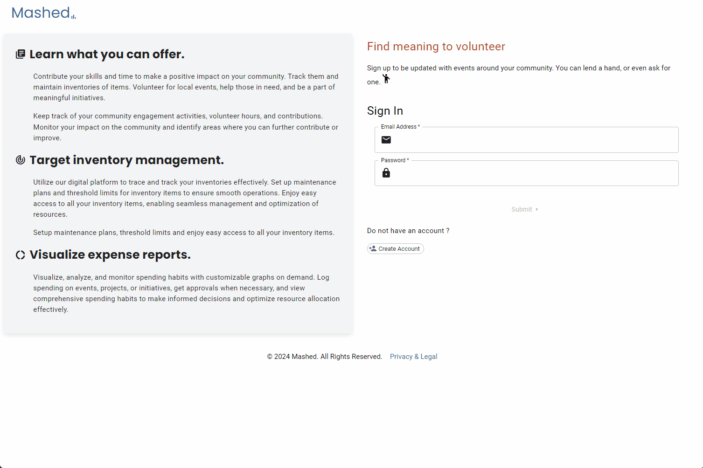

**Event related activities workflow**

Audience members can create an event. Audience members view the list of activated events by default. Users have the ability to view events closer to them with the location picker. Users can view details sourrounding the selected event as well. Furthermore, audience members can also edit the event if they are adminstrators of the select event. Audience members who are admin can also deactivate event or add other users as an administrator to the selected event. Audience members can also volunteer on requested help for any selected event.

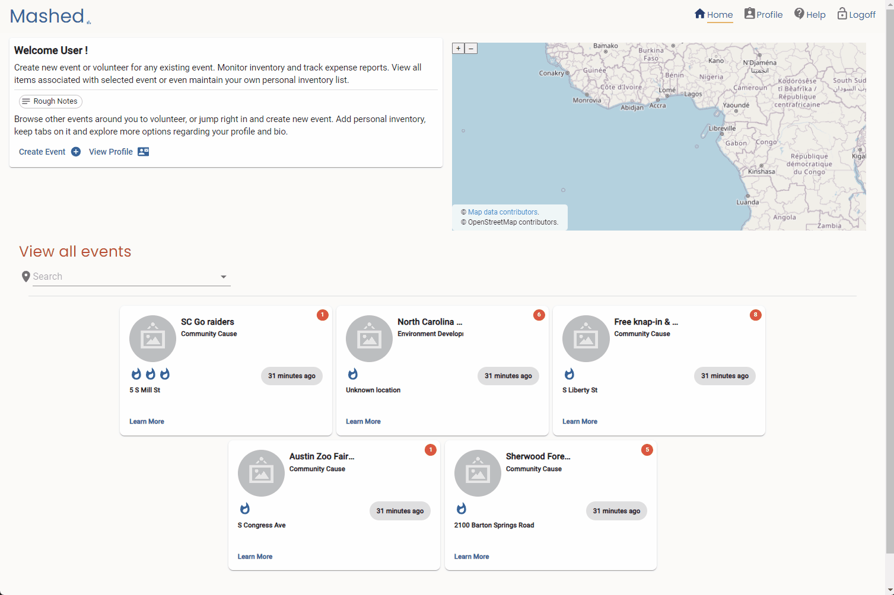
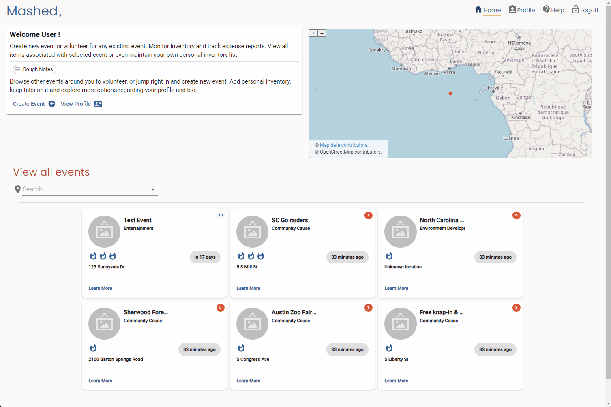
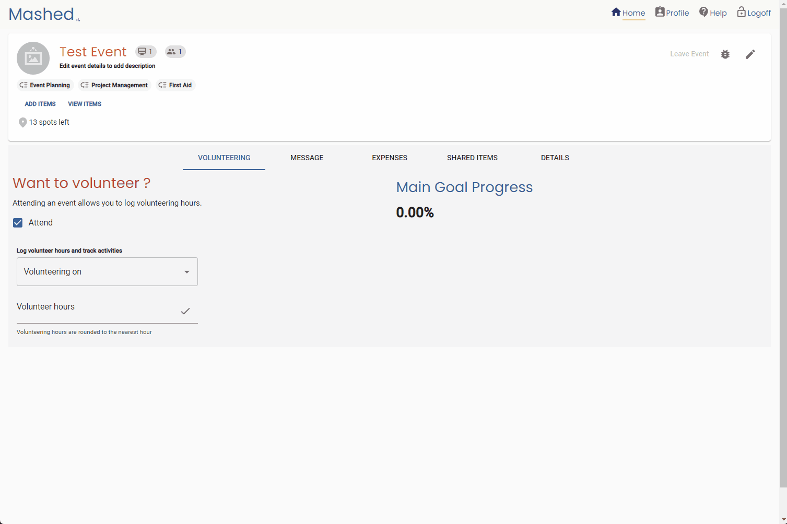
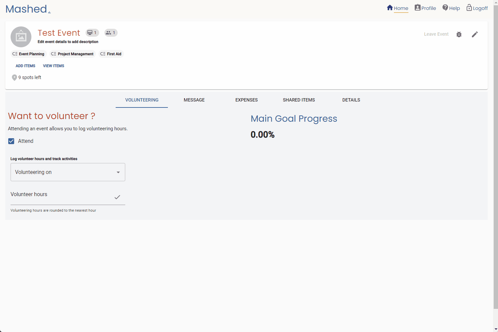
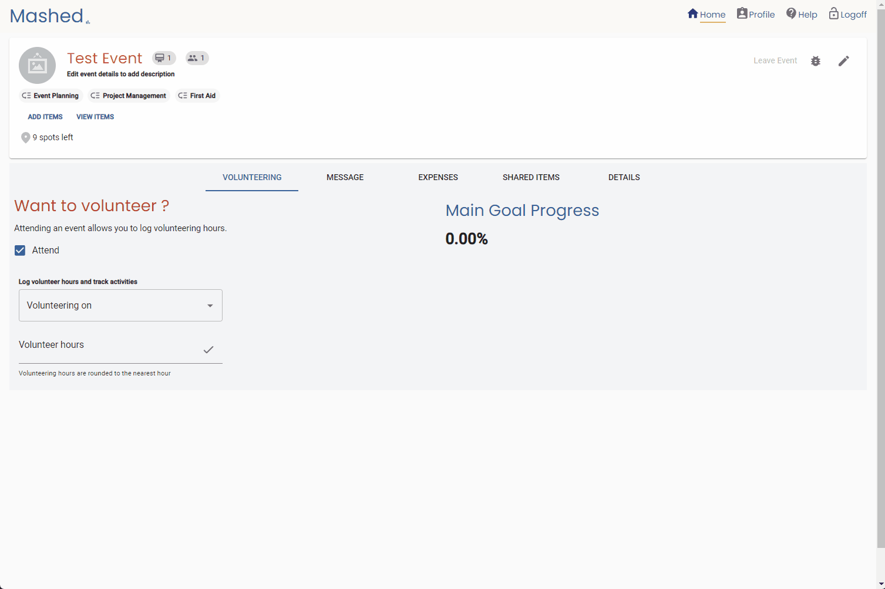
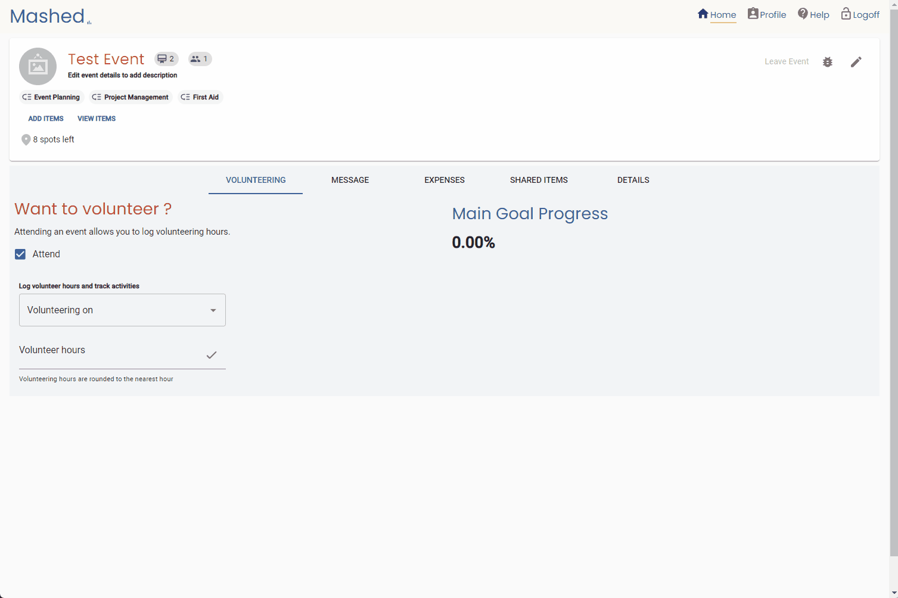
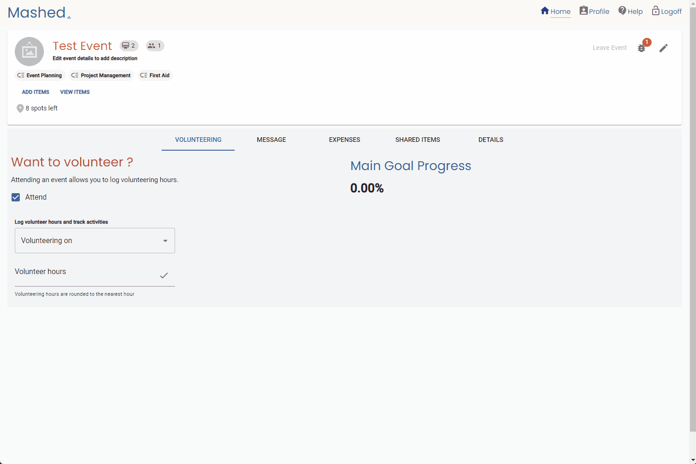

**Add item or expense / view item or expense workflow**

Audience members can add items to a selected event. Audience members can view the list of items that were added to the event. List of items are items that are needed for the event. Audience members can also add or view expenses in similar fashion.

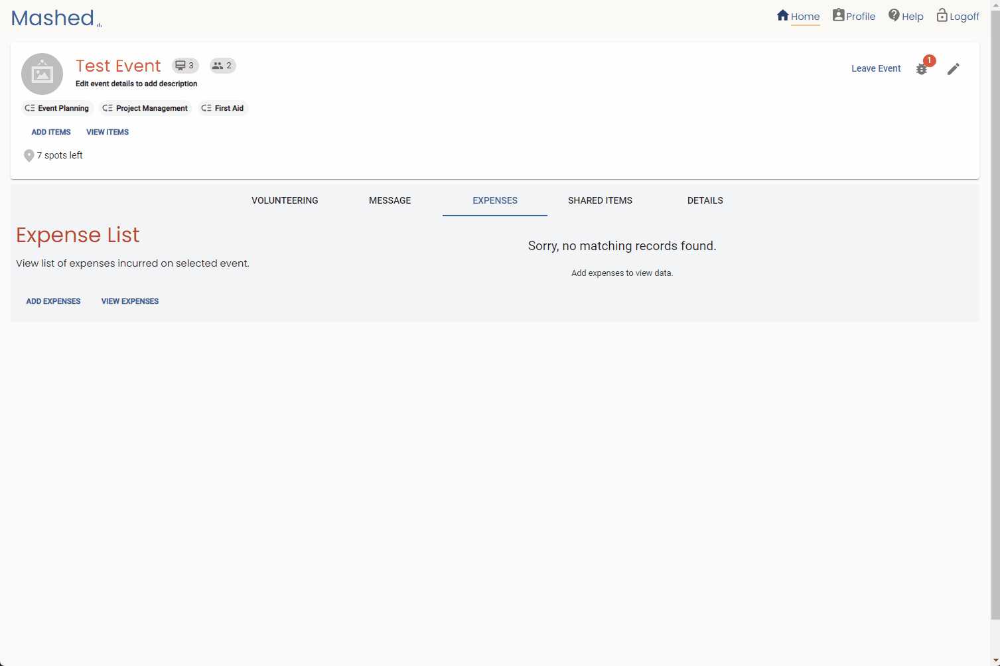

**Chat with other available users workflow**

Audience members can chat with other users if they have their details filled out. To support Children's Online Privacy Protection Rule ("COPPA"), all registering audience members must be at least 13 years of age by month. Submitting false information during registration of select audience will result in loss of account. Furthermore, all audience members must have their profile information filled out before chat is supported. To reduce profanity, filters have been used to request users to double check their chat messages if flagged words are found.

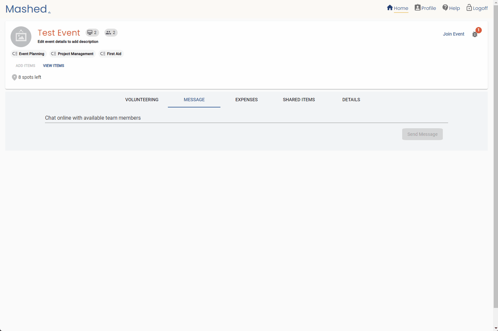

**Profile related activities workflow**

Audience members who are registered in the system are provided with the oppertunity to describe themselves. Edit your bio to tell other audience members what you believe in. View your impact on selected event from the recent activities tab. Update inventories to support personal inventory list. Bulk upload for inventories is also supported. Add rough notes to quickly jot information down. Associate personal inventories with events the selected audience is an admin of.

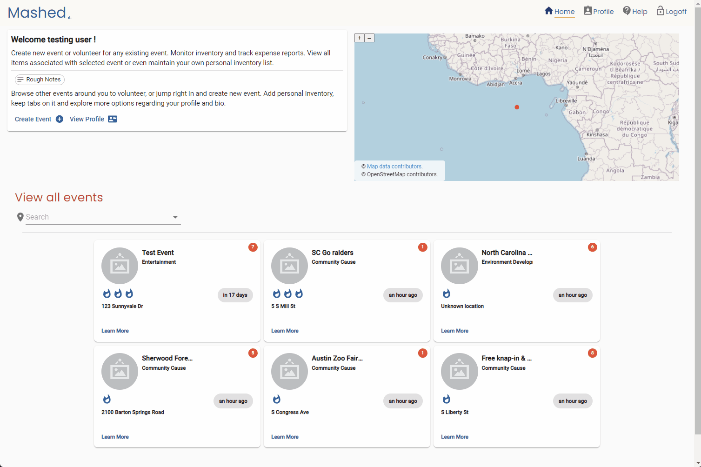
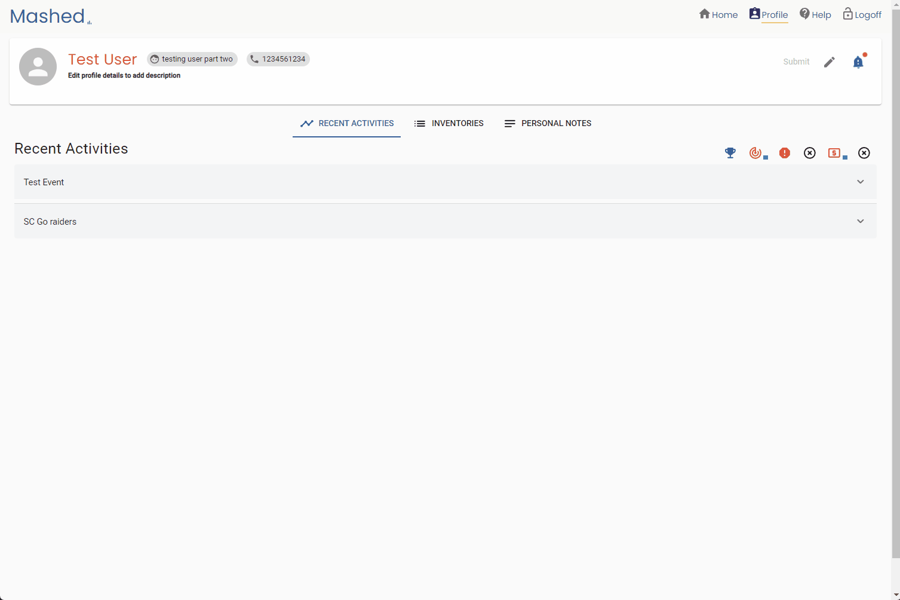

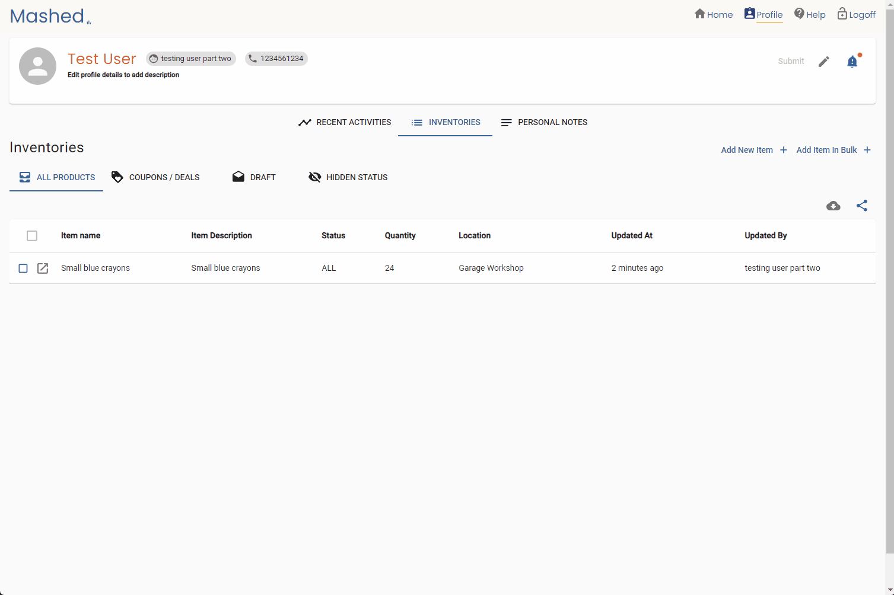
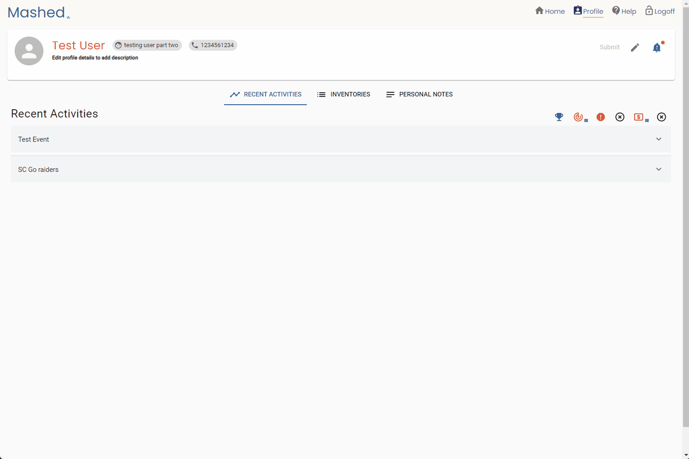

 -->

## Contact

If you have any questions or need support, feel free to reach out to us at earmuffjam@gmail.com
