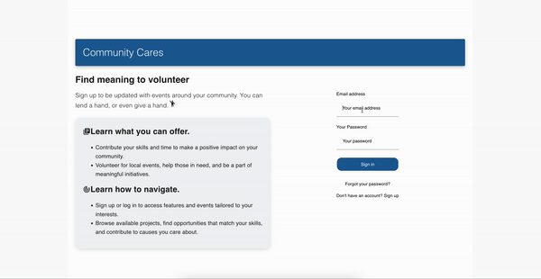
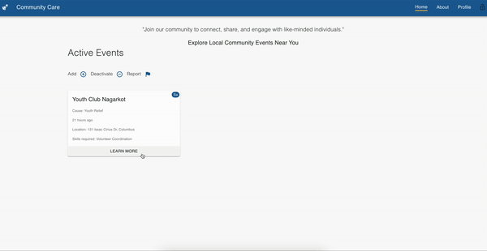

# Community Care

## Volunteer and Community Engagement Platform

**Community Care** is a dynamic web-based platform designed to foster connections between passionate volunteers and local community projects and initiatives. It serves as a central hub where individuals and organizations can unite, collaborate, and create a meaningful impact within their neighborhoods. Whether it's environmental conservation, education, social welfare, or arts and culture, we empower users to contribute their time, skills, and hearts to the causes they care deeply about.

## Key Features

| Feature             | Description                                                                                                                                                                                                      |
| ------------------- | ---------------------------------------------------------------------------------------------------------------------------------------------------------------------------------------------------------------- |
| User Profiles       | Create profiles that show your name and contact information. You can also add small interesting topics about yourself as well. These profiles facilitate better matching between volunteers and organizations.   |
| Project Listings    | Organizations can seamlessly post project details, upcoming events, and volunteer opportunities. Share crucial information such as the cause, location, date, time, and required skills needed for each project. |
| Search and Match    | Learn about various other different events and connect volunteers with projects that align with their location, chosen cause, or unique skills.                                                                  |
| Communication Tools | Efficient real-time messaging and notifications make it easy for volunteers and organizations to communicate and collaborate effectively.                                                                        |
| Impact Tracking     | Log your volunteer hours and activities, and see the positive impact your contributions have made. Be proud of the change you're creating.                                                                       |
| Mobile-Friendly     | Stay engaged on the go! Our mobile-optimized platform ensures you can access and contribute wherever you are.                                                                                                    |

## Application Usage

To simply use the application as intended, log in or sign up with the provided services. Once verified, you will be able to use community care as intended.

## Contributing

We welcome contributions from the community! Before submitting pull requests, please review our [contributing guidelines](CONTRIBUTING.md) to make the process smoother and more efficient.

## Application Brief Demonstration

**Version 01:**

**A. Log In and View Profile Page**

**B. Select an Active Event and View Event Details**

## License

This project is licensed under the [MIT License](LICENSE.md).

## Developer Guide

- Configured with CRA and Muiv4.
- Configured supabase for the server side implementations for local development.
- Dockerized containers. Seperate instances for database, apilayer and frontend.
- Each section of the app contains their own dev setup guide.

## Deployment Guide

- Deployed to the cloud with scripts.
- Use `main.sh` to run development instances.
  - ./main.sh -e
  - ./main.sh -f
  - ./main.sh -e
  - ./main.sh -m
- Run `-e` command first to get all .env variables for build.
- Run `-e` again before `-m` so that the migration scripts can run.

- Use `main.sh` to run test instance.
  - This test instance will have no data. Assumption is that you view community care app from the scratch.
  - ./main.sh -e
  - ./main.sh -t
  - ./main.sh -e
  - ./main.sh -m
- Run `-e` command first to get all .env variables for build.
- Run `-e` again before `-m` so that the migration scripts can run.

## Note: 
  Building with MacOS, we need to overwrite the `.env` file `DATABASE_DOCKER_CONTAINER_IP_ADDRESS` to `localhost`. This allows mac to connect via localhost to the docker container for development.

## Contact

If you have any questions or need support, feel free to reach out to us at communitycares@gmail.com.
